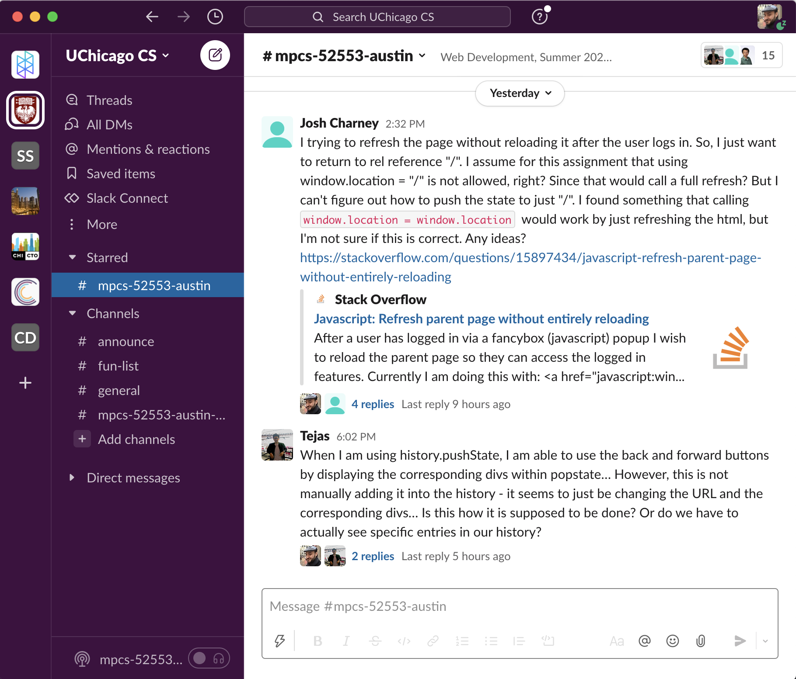

# [DRAFT] Final Project: Belay (a Slack clone)

30 points

**DUE: Friday, March 18 by 5:30pm**
(Due Thursday March 10, with more generous grading, for graduating students)

## THIS IS A DRAFT - SCOPE MAY BE SMALLER BUT WILL NOT BE BIGGER

### Introduction

As a capstone project for Web Development, we're going to combine the various
front-end and back-end techniques we've learned over the course to produce a
modern, database-backed single-page application. Specifically, we'll be building
our own (significantly smaller in scope) version of the popular workplace
messaging app Slack. We'll call our version [Belay](https://en.wikipedia.org/wiki/Belaying).

### Requirements

- Belay lets users send and read real-time chat messages that are organized
  into rooms called Channels. Users see a list of all the channels on the server
  and can click one to enter that channel. Inside, they see all the messages
  posted to that channel by any user, and can post their own messages.
  All messages belong to a channel and all channels are visible to all users; we
  don't need to implement private rooms or direct messages.
- Channel names are unique strings of numbers, letters, and underscores (and no
  spaces). Any user can create a new channel, and the user who created a channel
  can delete it and all messages.
- Like Slack, messages may be threaded as Replies in response to a message in a
  channel. Messages in the channel will display how many replies they have if
  that number is greater than zero. ~~Like in Slack, clicking will open the reply
  thread alongside the current messages in the channel, changing the screen from
  a 2-column layout to a 3-column layout.~~ We don't support nested threads;
  messages either belong directly to a channel or are replies in a thread to a
  message that does, but replies can't have nested replies of their own.

  You don't have to copy Slack's visual design, but for reference here are
  screenshots of how the columns for channel list, messages, and reply threads
  are laid out:

  Two-column layout:
  

- Like Slack, if a message contains any URLs that point to [valid image formats](https://developer.mozilla.org/en-US/docs/Web/HTML/Element/img#Supported_image_formats),
  display the images in the chat at the bottom of the message. Unlike Slack,
  we won't support uploading images from the user's computer.
- The channel display shows the number of unread messages in each channel (so
  somewhere you'll have to track the id of the most recent message a user has
  seen in each channel).
- Belay should use responsive styling to render reasonably in a phone browser.
  In particular, on mobile devices, when a user is not in a channel they should
  see the list of channels, and when they are in a channel or in a thread they
  should see just the messages in that channel or thread, with some menu element
  to let them return to the channel list.
- Users should have a display name and an email address, and be able to update
  either in the app. Users authenticate with their email address and a password.
- Belay is a single-page web application. We serve a single HTML request on load
  and do not refresh the page. As users navigate to a channel, the application
  updates the navigation bar to reflect what channel they are in, and navigating
  to the URL for a specific channel opens the single-page application with that
  channel open. You may use Flask's `render_template` to render the page on
  first load if desired.
- Belay automatically sends non-blocking requests to the server to check for new
  channels and new messages in a channel. New messages in the channel the user
  is looking at are automatically considered to be read.
- Other than loading the initial page, all interaction with the Belay server is
  handled via JSON API requests. This includes authenticating users, retrieving
  channels and messages, and creating new channels and messages. These requests
  are served by a Flask API.
- All data about users, channels, and messages is stored in a SQLite database. In
  your submission, include a SQL file of commands that can be run to create the
  database and its tables. Start the names of your migration files with
  [ISO-8601](https://en.wikipedia.org/wiki/ISO_8601) datetimes so that graders
  can run them in order. ~~Make sure when you create your database to set it up to
  handle unicode characters with `CHARACTER SET utf8mb4 COLLATE utf8mb4_unicode_ci;`~~
- You don't need to implement Slack features not listed here, like @-mentioning
  users, avatars, rich text or the like. If you have any questions about what is
  in scope, please ask on the [course Slack](https://app.slack.com/client/T71CT0472/C02TBJ5BHU2).

### Submissions and Grading

Graders will have Python 3.9+ with Flask installed, and a local install of
SQLite 3. Because graders must use the same environment to evaluate
submissions from multiple students, please do not require any additional
programs or packages to be installed. In your submission, include a README with
instructions for how to configure and run your app:
- First, graders will run your migrations in lexical order from the command line.
  ~~To make sure your database does not conflict with other students, use your
  GitLab name as the name of your database.~~
- Then, graders will start your app with a `flask run` command from the command
  line. Graders will have their FLASK_APP environment variable set to "app," so
  name your Flask file `app.py`.
- Graders will have the packages in `requirements.txt` installed with `pip3 install
  -r requirements.txt`. If you feel strongly that you need a package not listed
  there, ask on the course Slack.
- Graders will try to access your app in their browser at the URL that Flask
  prints to the command line, e.g. `* Running on http://127.0.0.1:5000/ (Press CTRL+C to quit)`
- Make sure that your app starts successfully under these circumstances. We'll
  do our best to make your app run even if it doesn't, but with a points penalty.

As always, remember to include in your submission any classmates you
collaborated with and any materials you consulted.

### Rubric (30 points possible - point values to be updated)

Database (5 points)
- Create database and tables with migrations in version control. Database
  supports Unicode characters
- Tables for channels, messages, and users
- Store passwords securely by hashing them with bcrypt
- Sanitize all database inputs
- Efficiently store last read message per channel per user

API (4 points)
- Login endpoint
- Authenticate to other endpoints via session token in the request header (not as a URL param)
- Endpoints to create and get channels and messages
- Get new message counts by channel without fetching all the message contents

Responsive Layout (5 points)
- Login and username update flows
- Show channels, messages, and replies (when shown) in 3-column grid
- Show/hide threaded replies
- On narrow screens, one-column layout with menu bar
- Parse image URLs that appear in messages and display the images at the end of
  the message

Single-Page State (4 points)
- Only serve one HTML request
- Push channel and thread location to the history and navigation bar
- Loading the unique URL of a channel or thread should open the app to that
  channel or thread.
- Track last read message per channel

Asynchronous Request Handling (2 points)
- Continuously poll for new messages, only in the channel the user is in
- Continuously poll for new unread message counts per channel
